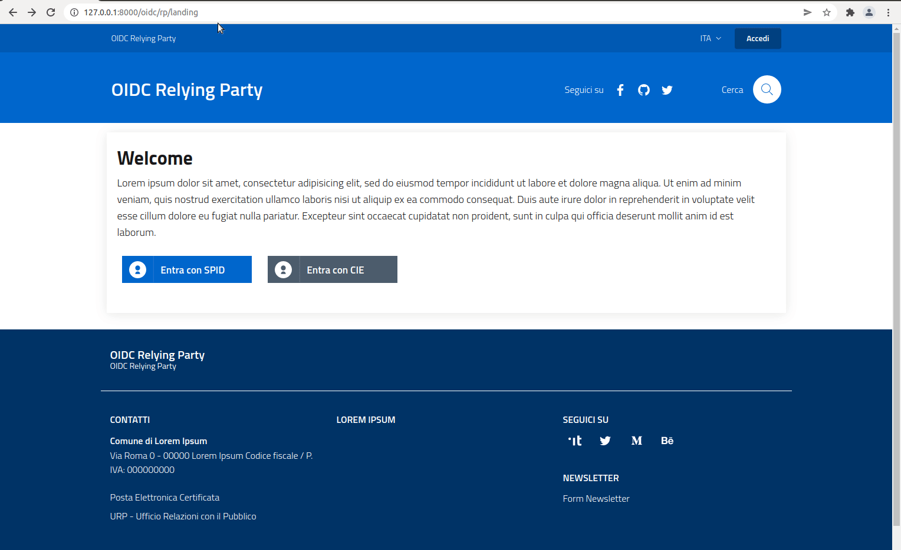

# SPID/CIE OIDC Federation SDKs


> ⚠️ __This project is a WiP, please wait for the first stable release v0.6.0.__

OpenID Connect 1.0 is a simple identity layer on top of the OAuth 2.0 protocol.
It enables Clients to verify the identity of the End-User based on the authentication
performed by an Authorization Server, as well as to obtain basic profile information
about the End-User in an interoperable and REST-like manner.

SPID/CIE OIDC Federation is a suite of Django applications designed to
make it easy to build an [Openid Connect Federation](https://openid.net/specs/openid-connect-federation-1_0.html), 
each of these can be installed separately within a django project:

### spid_cie_oidc.accounts

customizable app that extended the Django User model.

### spid_cie_oidc.entity

OIDC Federation django app that implements OIDC Federation 1.0 Entity Statements, metadata discovery, Trust Chain, Trust Marks and Metadata policy.
Technical specifications: [__OIDC Federation Entity__](docs/technical_specifications/ENTITY.md)

### spid_cie_oidc.authority

OIDC Federation API and models for [__OIDC Federation Authority/Intermediary__](docs/technical_specifications/AUTHORITY.md). 

### spid_cie_oidc.onboarding

[__OIDC Federation onboarding demo service__](docs/technical_specifications/ONBOARDING.md).

### spid_cie_oidc.relying_party

[__Openid Connect Relying Party__](docs/technical_specifications/RELYING_PARTY.md) and test suite for OIDC Providers.

### spid_cie_oidc.provider

[__Openid Connect Provider__](docs/technical_specifications/PROVIDER.md)and test suite for OIDC Relying Parties.

## Contents

All the Django apps are available in the folder `spid_cie_oidc/`.
The examples projects are available in the folder `examples/`.

There is a substantial difference between an app and a project.
The app is installed using a common python package manager, such as _poetry_ or _pip_,
and can be used, inherited, and integrated into other projects.

A project is a service configuration that integrates one or more applications.
In this repository we have three example projects for demo purpose:

 - federation_authority
 - relying_party
 - provider


An onboarded Relying Party with a succesful authentication.

## Summary

* [Features](#features)
* [Setup](#setup)
    * [Install as Django application](#install-as-django-application)
    * [Configure the example projects](#configure-the-example-projects)
    * [Docker compose](#docker-compose)
* [Usage](#usage)
* [Contribute](#contribute)
    * [Contribute as end user](#contribute-as-end-user)
    * [Contribute as developer](#contribute-as-developer)
* [License and Authors](#license-and-authors)
* [Implementations notes](#implementation-notes)


## Features

- SPID and CIE OpenID Connect Provider
- SPID and CIE OpenID Connect Relying Party
- OIDC Federation onboarding demo service
- OIDC Federation 1.0
  - Trust Anchor and Intermediary
  - Automatic client registration
  - Entity profiles and Trust marks
  - Trust chain storage and discovery
  - Entity statement resolve endpoint
  - Fetch statement endpoing
  - List entities endpoint
  - Federation CLI
    - RP: build trust chains for all the available OPs
    - OP: build trust chains for all the available RPs
- OIDC Federation web tools:
  - Create a JWK
  - Convert a private jwk to PEM certificate/key
  - Convert a public jwk to PEM certificate/key
  - Decode a jwt and verify the signature
  - Resolve entity statement web UI
  - Validating a trust mark web UI
- Multitenancy, a single service can configure many entities like RPs, OP, Trust Anchors and intermediaries
- gettext compliant (i18n)
- Bootstrap Italia Design templates


## Setup

Consult the [setup documentation](docs/SETUP.md). 

## Docker compose

> TODO: Not available until v0.6.0 release

## Usage

The demo propose a small federation composed by the following entities:

 - Federation Authority, acts as trust anchor and onboarding system. It's available at `http://127.0.0.1:8000/`
 - OpenID Relying Party, available at `http://127.0.0.1:8001/`
 - OpenID Provider, available at `http://127.0.0.1:8002/`

Examples User, Password:

 - admin oidcadmin

## Contribute

Your contribution is welcome, no question is useless and no answer is obvious, we need you.

#### Contribute as end user

Please open an issue if you've discoveerd a bug or if you want to ask some features.

#### Contribute as developer

Please open your Pull Requests on the __dev__ branch. 
Please consider the following branches:

 - __main__: where we merge the code before tag a new stable release.
 - __dev__: where we push our code during development.
 - __other-custom-name__: where a new feature/contribution/bugfix will be handled, revisioned and then merged to dev branch.


Backup and share your demo data
````
# backup your data (upgrade example data), -e excludes.
./manage.py dumpdata -e admin -e auth -e contenttypes -e sessions > dumps/example.json
````

In this project we adopt [Semver](https://semver.org/lang/it/) and
[Conventional commits](https://www.conventionalcommits.org/en/v1.0.0/) specifications.

## License and Authors

This software is released under the Apache 2 License by:

- Giuseppe De Marco <giuseppe.demarco@teamdigitale.governo.it>.

In this project we use the 
[metadata policy code](https://github.com/peppelinux/spid-cie-oidc-django/blob/main/spid_cie_oidc/entity/policy.py)
written by Roland Hedberg and licensed under the same Apache 2 license.

## Implementation notes

All the operation related to JWT signature and encryption are built on top of [IdentityPython](https://idpy.org/) 
[cryptojwt](https://github.com/IdentityPython/JWTConnect-Python-CryptoJWT)

This project proposes an implementation of the italian OIDC Federation profile with
__automatic_client_registration__ and the adoption of the trust marks as mandatory.

If you're looking for a fully compliant implementation of OIDC Federation 1.0,
with a full support of explicit client registration, please look at idpy's
[fedservice](https://github.com/rohe/fedservice).
