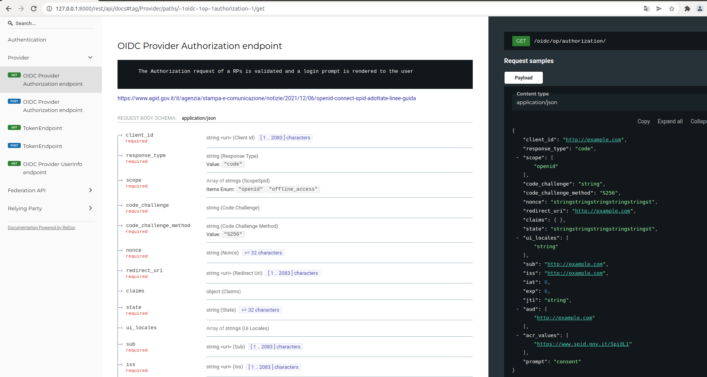
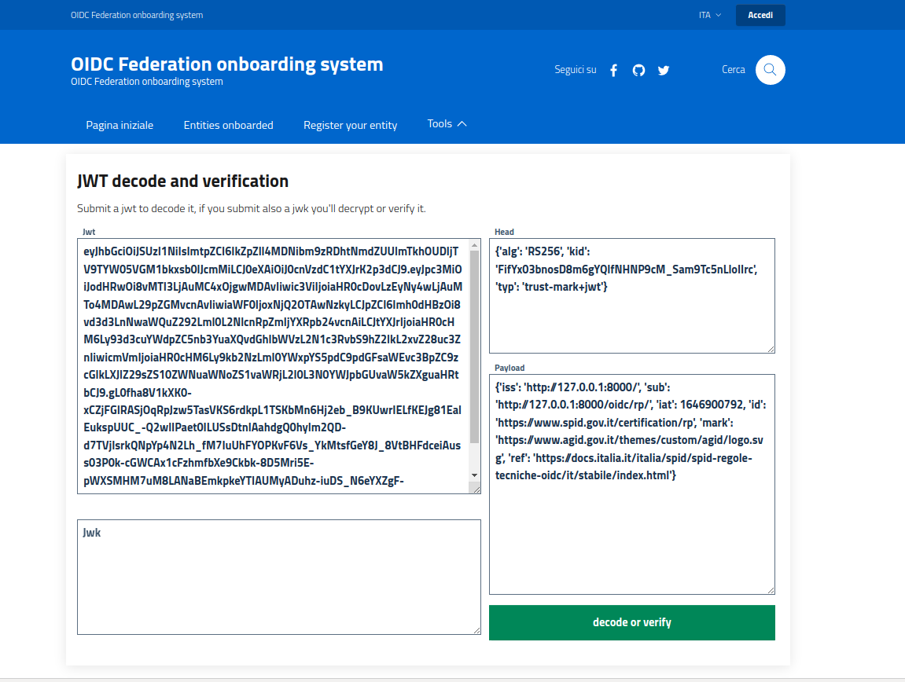

# SPID/CIE OIDC Federation SDK


[](https://codeclimate.com/github/italia/spid-cie-oidc-django/maintainability)
[](https://codeclimate.com/github/italia/spid-cie-oidc-django/test_coverage)


[](https://github.com/italia/spid-cie-oidc-django/issues)
[](https://slack.developers.italia.it/)
[](https://developersitalia.slack.com/archives/C7E85ED1N/)


SPID/CIE OIDC Federation is a suite of Django applications designed to
make it easy to build an [Openid Connect Federation](https://openid.net/specs/openid-connect-federation-1_0.html), 
each of these can be installed separately within a django project. These are the following:

| Application | Description |
| :--- | --- |
| __spid_cie_oidc.accounts__ | Customizable application that extends the django User model. |
| __spid_cie_oidc.entity__ | OpenID Connect Federation django app that implements OIDC Federation 1.0 Entity Statements, metadata discovery, Trust Chain, Trust Marks and Metadata policy. Technical specifications: [__OIDC Federation Entity__](docs/technical_specifications/ENTITY.md) |
| __spid_cie_oidc.authority__ | OpenID Connect Federation API and models for __OIDC Federation Trust Chain/Intermediate__, [Technical specifications](docs/technical_specifications/AUTHORITY.md) and [tutorial](docs/CREATE_A_FEDERATION.md). 
| __spid_cie_oidc.onboarding__ | [__OpenID Connect Federation onboarding demo service__](docs/technical_specifications/ONBOARDING.md) and tools|
| __spid_cie_oidc.relying_party__ | [__OpenID Connect Relying Party__](docs/technical_specifications/RELYING_PARTY.md) and test suite for OIDC Providers |
| __spid_cie_oidc.provider__ | [__OpenID Connect Provider__](docs/technical_specifications/PROVIDER.md) and test suite for OIDC Relying Parties |

## Summary

* [Features](#features)
* [Setup](#setup)
* [Docker](#docker)
* [Usage](#usage)
* [OpenAPI Schema 3](#openapi-schema-3)
* [Tools](#tools)
* [Contribute](#contribute)
    * [Contribute as end user](#contribute-as-end-user)
    * [Contribute as developer](#contribute-as-developer)
* [Implementations notes](#implementation-notes)
* [License and Authors](#license-and-authors)

------------------------------------------------


_An onboarded Relying Party with a succesful authentication._

## Setup

All the Django apps are available in the folder `spid_cie_oidc/`.
The examples projects are available in the folder `examples/`.

There is a substantial difference between an app and a project.
The app is installed using a common python package manager, such as _poetry_ or _pip_,
and can be used, inherited, and integrated into other projects.

A project is a service configuration that integrates one or more applications.
In this repository we have three example projects:

 - federation_authority
 - relying_party
 - provider

Federation Authority loads all the applications for development needs, acting as both authority, SPID RP and SPID OP.
This allows us to make a demo by starting a single service. See admin page `http://127.0.0.1:8000/admin/` and user login page `http://127.0.0.1:8000/oidc/rp/landing/`.

Then we have also another Relying Party, as indipendent project, and another Provider configured with the CIE profile.
Relying party and Provider are examples that only integrate
__spid_cie_oidc.entity__ and __spid_cie_oidc.provider__ or __.relying_party__ as applications.

Read the [setup documentation](docs/SETUP.md) to get started.

## Docker

### Docker image

````
docker pull ghcr.io/italia/spid-cie-oidc-django:latest
````

### Docker compose

Install Docker using the packages distributed from the official website and the following tools.
````
sudo pip install docker-compose
````

Please do your customizations in each _settingslocal.py_ files and/or in the example dumps json file.

Change hostnames from 127.0.0.1 to which one configured in the compose file, in the settingslocal.py files and in the dumps/example.json files.
In our example we rename:

- http://127.0.0.1:8000 to http://trust-anchor.org:8000/
- http://127.0.0.1:8001 to http://relying-party.org:8001/
- http://127.0.0.1:8002 to http://cie-provider.org:8002/

We can do that with the following steps:

- Execute `bash docker-prepare.sh`
- Customize the example data and settings contained in `examples-docker/` if needed (not necessary for a quick demo)


Run the stack
````
sudo docker-compose up
````

Configure a proper DNS resolution for trust-anchor.org. In GNU/Linux we can configure it in `/etc/hosts`:
````
127.0.0.1   localhost  trust-anchor.org relying-party.org cie-provider.org wallet.trust-anchor.org
````

Point your web browser to `http://relying-party.org:8001/oidc/rp/landing` and do your first oidc authentication.


## Usage

The demo proposes a small federation composed by the following entities:

 - Federation Authority, acts as trust anchor and onboarding system. It's available at `http://127.0.0.1:8000/`. It has also an embedded Spid provider and a embedded Relying Party available at `/oidc/rp/landing`.
 - OpenID Relying Party, available at `http://127.0.0.1:8001/`
 - CIE OpenID Provider, available at `http://127.0.0.1:8002/`

In the docker example we have only the Federation Authority with an embedded SPID OP and a RP.

Examples Users and Passwords:

 - __admin__ __oidcadmin__
 - __user__ __oidcuser__


## OpenAPI Schema 3

Each application has an exportable OAS3 available at `/rest/schema.json` with a browsable reDoc UI at `/rest/api/docs`.


_The reDoc OAS3 browsable page._


## Tools

The OnBoarding app comes with the following collection of tools:

- JWK
    - Create a jwk
    - Convert a private JWK to PEM
    - Convert a public JWK to PEM
    - Convert a private PEM to JWK
    - Convert a public PEM to JWK
    - JWT decode and verification
- Federation
    - Resolve entity statement
    - Apply policy
- Validators
    - Validate OP metadata spid
    - Validate OP metadata cie
    - Validate RP metadata spid
    - Validate RP metadata cie
    - Validate Authn Request spid
    - Validate Authn Request cie
    - Validate Entity Configuration
    - Trust mark validation
- Schemas
    - Authorization Endpoint
    - Introspection Endpoint
    - Metadata
    - Token Endpoint
    - Revocation Endpoint
    - Jwt client Assertion


_OIDC tools facilitates the lives of developers and service operators, here a simple interface to decode and verify a JWT._

To explore a federation on the commandline, use the [ofcli](https://github.com/dianagudu/ofcli) tool. It can be used to export federation metadata to json files for further analysis.

## Contribute

Your contribution is welcome, no question is useless and no answer is obvious, we need you.

#### Contribute as end user

Please open an issue if you've discoveerd a bug or if you want to ask some features.

#### Contribute as developer

Please open your Pull Requests on the __dev__ branch. 
Please consider the following branches:

 - __main__: where we merge the code before tag a new stable release.
 - __dev__: where we push our code during development.
 - __other-custom-name__: where a new feature/contribution/bugfix will be handled, revisioned and then merged to dev branch.

Backup and share your demo data
````
# backup your data (upgrade example data), -e excludes.
./manage.py dumpdata -e admin -e spid_cie_oidc_relying_party -e spid_cie_oidc_provider -e spid_cie_oidc_relying_party_test -e auth -e contenttypes -e sessions --indent 2 > dumps/example.json
````

In this project we adopt [Semver](https://semver.org/lang/it/) and
[Conventional commits](https://www.conventionalcommits.org/en/v1.0.0/) specifications.

## Implementation notes

All the operation related to JWT signature and encryption are built on top of [IdentityPython](https://idpy.org/) 
[cryptojwt](https://github.com/IdentityPython/JWTConnect-Python-CryptoJWT)

This project proposes an implementation of the italian OIDC Federation profile with
__automatic_client_registration__ and the adoption of the trust marks as mandatory.

If you're looking for a fully compliant implementation of OIDC Federation 1.0,
with a full support of explicit client registration, please look at idpy's
[fedservice](https://github.com/rohe/fedservice).

#### General Features

- SPID and CIE OpenID Connect Provider
- SPID and CIE OpenID Connect Relying Party
- OIDC Federation onboarding demo service
- OIDC Federation 1.0
  - Trust Anchor and Intermediary
  - Automatic client registration
  - Entity profiles and Trust marks
  - Trust chain storage and discovery
  - Entity statement resolve endpoint
  - Fetch statement endpoing
  - List entities endpoint
  - Advanced List endpoint
  - Federation CLI
    - RP: build trust chains for all the available OPs
    - OP: build trust chains for all the available RPs
- Multitenancy, a single service can configure many entities like RPs, OP, Trust Anchors and intermediaries
- gettext compliant (i18n)
- Bootstrap Italia Design templates

## License and Authors

This software is released under the Apache 2 License by:

- Giuseppe De Marco <giuseppe.demarco@teamdigitale.governo.it>.

In this project we use the 
[metadata policy code](https://github.com/peppelinux/spid-cie-oidc-django/blob/main/spid_cie_oidc/entity/policy.py)
written by Roland Hedberg and licensed under the same Apache 2 license.
