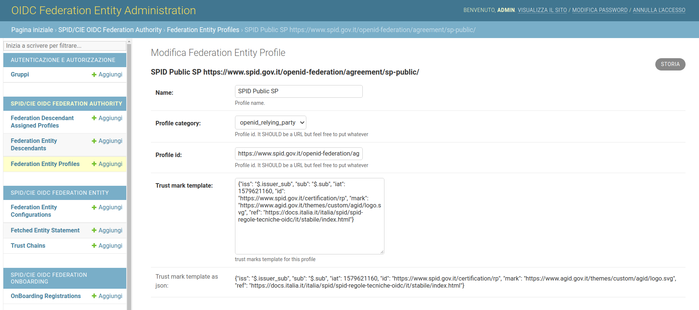
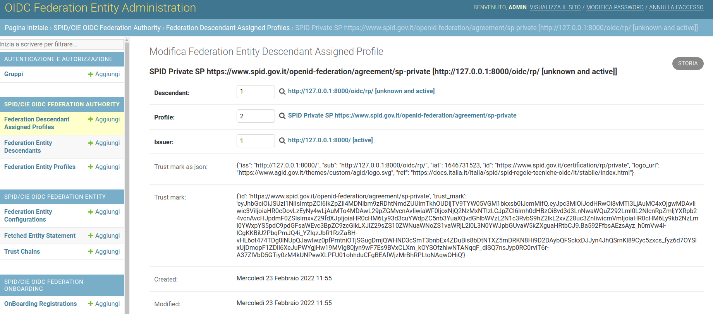
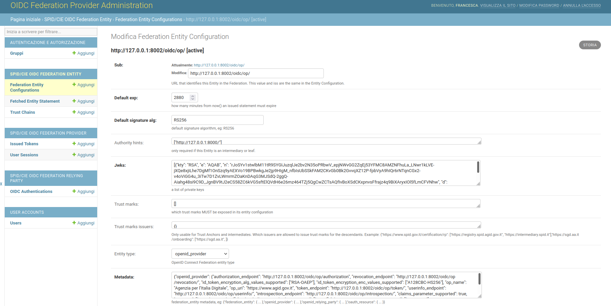
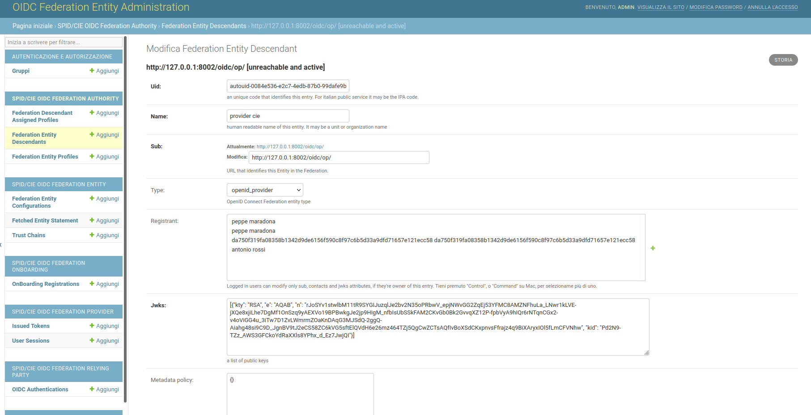
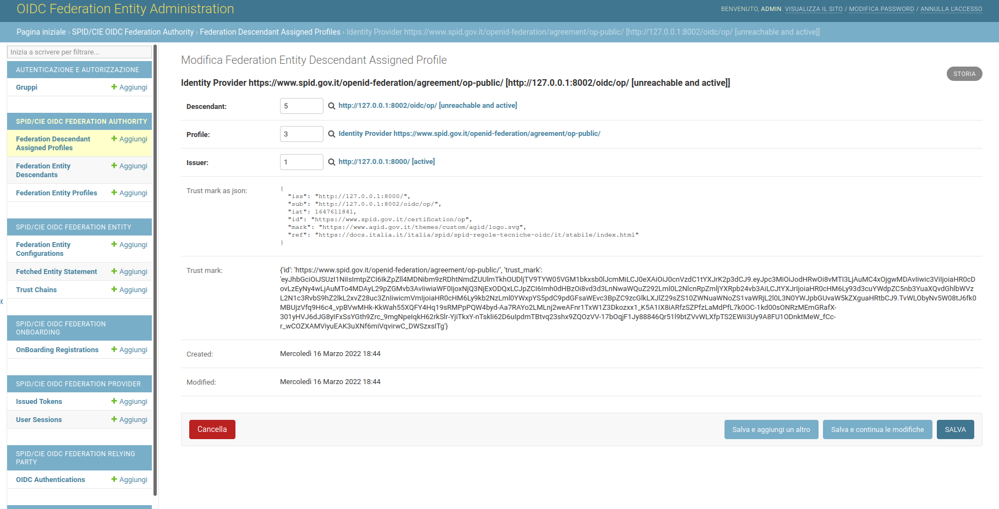
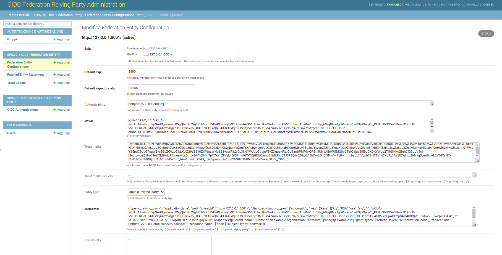
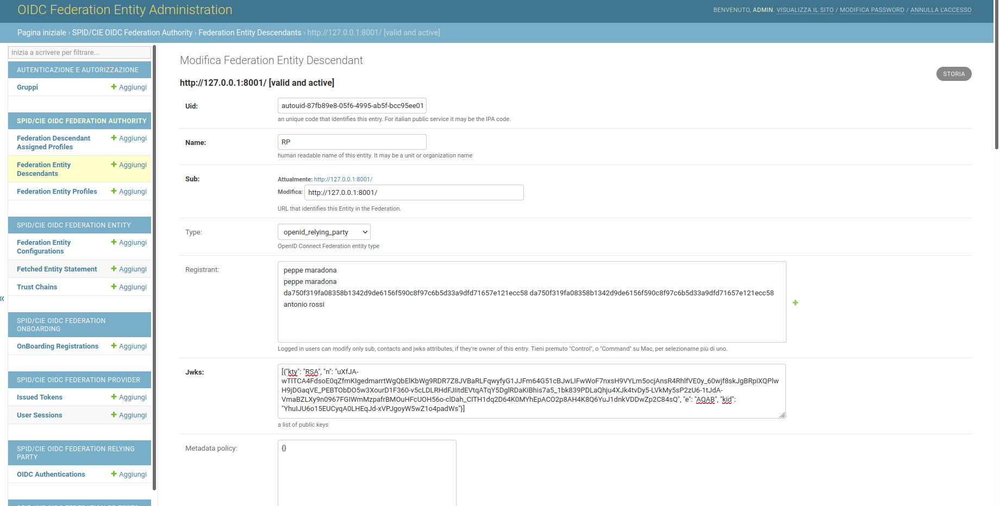
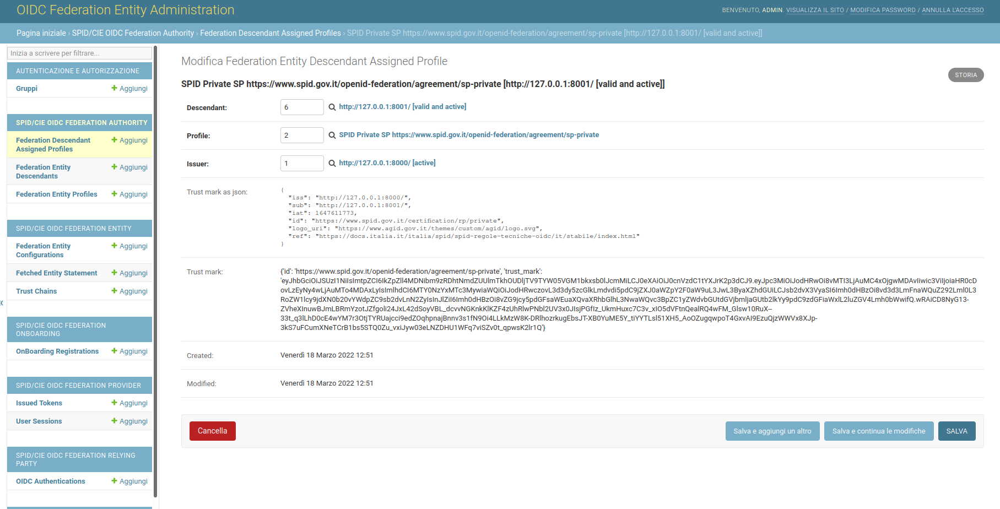

## Create a OpenID Connect Federation

I nthis tutorial we show how to setup a Federation with a Trust Anchor, a Provider and a Relying Party.
We can achieve this though the Admin backend or via internal API.

### Create a Federation Authority via web

__setup__
1. add `spid_cie_oidc.entity` and `spid_cie_oidc.authority` in settings.INSTALLED_APPS
2. do migrations `./manage.py migrate`
3. create superuser `./manage.py createsuperuser`
4. log in the `/admin` interface

__configure the federation entity__
1. Click on _Federation Entity Configuration_ and create your entity see `federation_authority` example


### Create a Federation Descendant via web

__configure descendants entities__
1. Click on _Federation Entity Descendant_ and configure a descendant
2. Click on _Federation Entity Profile_ and create the desidered profiles and trust marks template
3. Click on _Federation Entity Descendant Assigned Profile_ and assing at least one profile to the new descendant



A profile that may be assigned to a Relying Party.



An assigned profile to a Relying Party.


### Create a Federation Authority via API

The JWKS if not submitted will be created automatically.

````
from spid_cie_oidc.entity.models import *

TA_SUB = "http://testserver/"
FA_METADATA = {
    "federation_entity": {
        "contacts": ["ops@localhost"],
        "federation_fetch_endpoint": f"{TA_SUB}/fetch",
        "homepage_uri": f"{TA_SUB}",
        "name": "example TA",
    }
}
TM_ISSUERS = {
    "https://www.spid.gov.it/certification/rp/public": [
        TA_SUB,
        "https://public.intermediary.spid.it",
    ],
    "https://www.spid.gov.it/certification/rp/private": [
        TA_SUB,
        "https://private.other.intermediary.it",
    ],
    "https://sgd.aa.it/onboarding": ["https://sgd.aa.it"],
}
FA_CONSTRAINTS = {"max_path_length": 1}

ta_conf_data = dict(
    sub=TA_SUB,
    metadata=FA_METADATA,
    constraints=FA_CONSTRAINTS,
    is_active=True,
    trust_marks_issuers=TM_ISSUERS,
)

FederationEntityConfiguration.objects.create(**ta_conf_data)
````

Using different kind of metadata we can create OpenID Relying Parties or Providers.
Just rememeber, for these latter, to add also the authority_hints value as follow.

````
authority_hints = ["http://testserver/"]
````

### Create a Federation Descendant via API

see [unit tests](https://github.com/italia/spid-cie-oidc-django/blob/main/spid_cie_oidc/authority/tests/test_02_trust_anchor_intermediary.py#L32).


### Create a Provider in a Federation Authority

In you project configure the settingslocal.py file and import it in your settings.py file, for all the
 provider configuration parameters see [here](https://github.com/italia/spid-cie-oidc-django/blob/newbranch/docs/technical_specifications/PROVIDER.md).
 

For CIE or Spid provider configure `OIDCFED_PROVIDER_PROFILE` parameter in settingslocal.py as "cie" or "spid"

In examples/provider configure a federation entity configuration as OP:

````
./manage.py runserver 0.0.0.0:8002
````
Open _http://127.0.0.1:8002/admin_ in you web browser and in FederationEntityConfiguration create a new entry with the following data:

- sub (eg. 'http://127.0.0.1:8002/oidc/op/')
- authority hints, list of trust anchor(eg. ["http://127.0.0.1:8000/"])
- Jwks, private jwks, if you don't have one please create a pair of private using the OnBoarding tool `Create a JWK`.
- metadata, url paths in metadata need to be mapped in `examples/relying_party/urls.py`, [here](https://github.com/italia/spid-cie-oidc-django/blob/dev/examples/provider/provider/urls.py#L48).

An example of metadata [here](https://github.com/italia/spid-cie-oidc-django/blob/dev/spid_cie_oidc/provider/tests/settings.py#L20)



In examples/federation_authority configure OP cie as descendant and assign it a profile, as shown in the [previous section](#create-a-federation-descendant-via-web).
In the admin page of your Trust Anchor (http://127.0.0.1:8000/admin) create a descendant entity with the following paramenters:

- OP name
- sub (eg. 'http://127.0.0.1:8002/oidc/rp/')
- Jwks, public jwks. If you don't have one please create a pair of private/public using the OnBoarding tool `Create a JWK`



Then assign a profile, select 'Identity Provider'.




### Create a Relying Party

In you project configure the settingslocal.py file and import it in your settings.py file.
For more information on configuration parameters see [here](https://github.com/italia/spid-cie-oidc-django/blob/dev/docs/technical_specifications/RELYING_PARTY.md).

Then apply migrations:
 ````examples/relying_party/manage.py migrate````

In examples/relying_party configure a federation entity configuration as RP:

````
./manage.py runserver 0.0.0.0:[port]
````
In the admin page (http://127.0.0.1:[port]/admin) create a FederationEntityConfiguration with at least these parameters:

- sub (eg. 'http://127.0.0.1:[port]/oidc/rp/')
- authority hints, list of trust anchor(eg. ["http://127.0.0.1:8000/"])
- Jwks, private jwks, If you don't have one please create a pair of private/public using the OnBoarding tool `Create a JWK`.
- metadata, url paths in metadata need to be mapped in examples/relying_party/urls.py, [here](https://github.com/italia/spid-cie-oidc-django/blob/dev/examples/relying_party/relying_party/urls.py#L42).

An example of metadata[here](https://github.com/italia/spid-cie-oidc-django/blob/dev/spid_cie_oidc/authority/tests/settings.py#L91)




In examples/federation_authority configure RP as descendant and assign it a profile.
In federation admin console (http://127.0.0.1:8000/admin) the following data are required:

- RP name
- sub (eg. 'http://127.0.0.1:[port]/oidc/rp/')
- Jwks, public jwks, the public jwk of the private configurd in the FederationEntityConfiguration of the RP.



Then assign the profile, 'SPID Private SP'.




In relying_party service build trust chain for all the configure OpenID Connect Provider. These are configured in the parameter `OIDCFED_IDENTITY_PROVIDERS` in settingslocal.py.
````
examples/relaying_party/manage.py fetch_openid_providers --start -f
````

Connect to the login page specified in settingslocal.py by 'LOGIN_URL' parameter (eg. 'http://127.0.0.1:[port]/oidc/rp/landing' where 'LOGIN_URL=/oidc/rp/landing') and start authentication.
