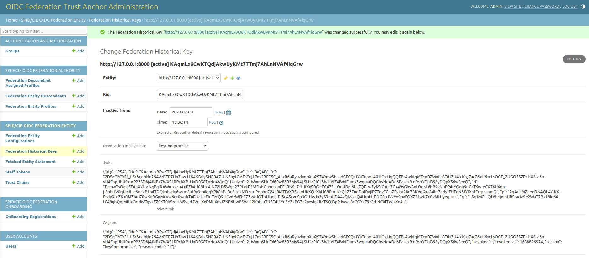

# Federation historical key registry

If you have to revoke/expire a federation key of one of your entity you just have to:

1. create a new `federationhistoricalkey` at `/admin/spid_cie_oidc_entity/federationhistoricalkey/`
2. copy the Federation KID you want to instantiate and configure the `inactive_from` datetime
3. optionally you can specify a revocation motivation if the key is not simply expired

When you save, the correspondig jwk configured in your entity's `jwks_fed` JSON object will be removed 
from your entity configuration and published in the historical registry

*The revoked key with the motivation of the revocation*.
