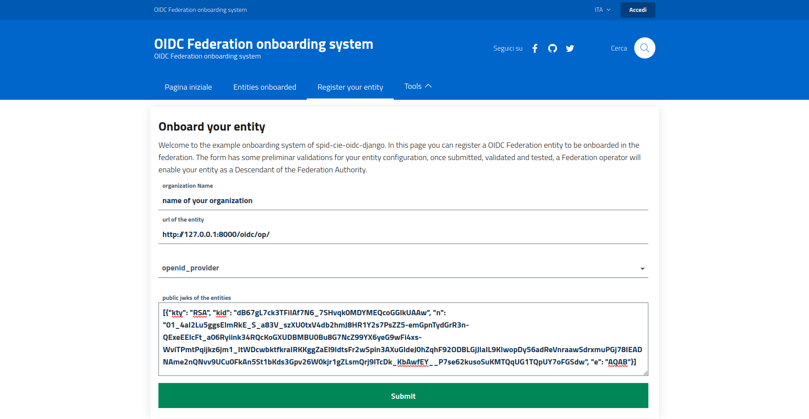
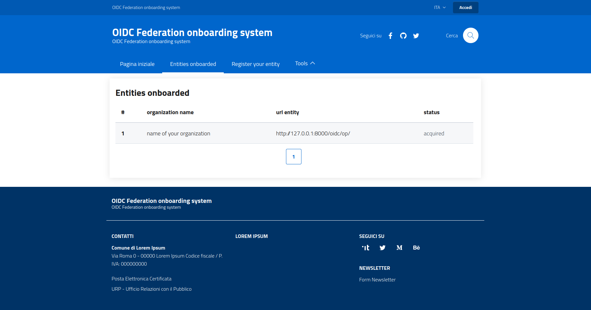
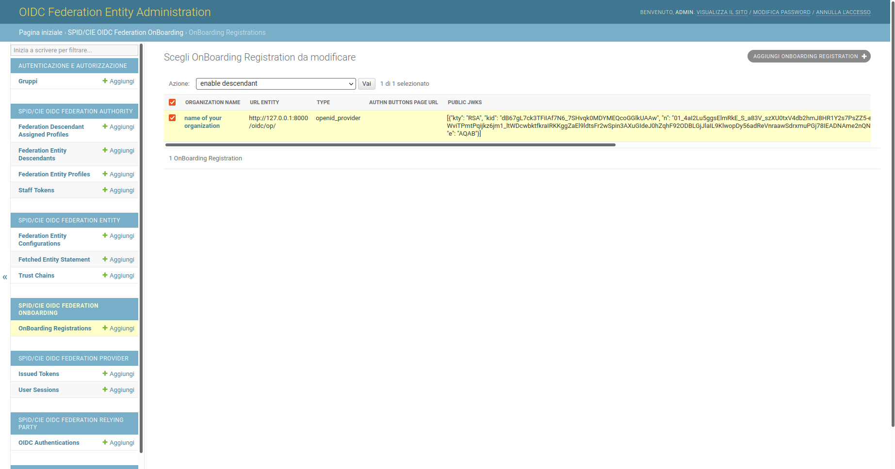

# OIDC Federation 1.0 onboarding service DEMO

> ⚠️ This application is only intended for demostration purpose and not for production use.

## General OnBoarding registration flow

The actions to accredit an entity within the demo federation are described below.

### Entity Registration

To accredit a new entity point your browser to /onboarding/landing and click on the button `Register your entity`.

The user accesses the submission form of a federation entity, fill in the following REQUIRED fields:

    1. Organization Name (String)
    2. unique identifier of the entity (url) of the instance in production/stage (URL)
        1. validators:
            - download of the Entity Configuration, a self-signed statement
            - JWS signature validation
            - structure analysis of the JSON (json-schema)
            - presence and validation of the claim  __authority_hints__ that MUST matches to the onboarding system entity (trust anchor)
    3. TODO: IPA code or VAT number, that determines whether the participant is public or private (String)
        1. validators:
            - TODO: fetch and verify the IPA code from the national registry of public services
    4. public jwks (List[JSON])
        1. validators:
            - check if the jwks is public and not private (for sake!)
            - check of the presence of kid claim
            - check that the certificate is not expired
            - check that the kid is unique and of the lenght of a minimum JWK thumbprint length
    5. TODO: at least one email contact (String)
        1. validators:
            - Email Field
    6. URL where the RP page shows the SPID and CIE authentication button
        1. validators:
            - Null, just for demo purpose
    7. TODO: SPID/CIE authentication request trigger url at the onboarding system testing OP
        1. validators:
            - Null, just for demo purpose

After a successful submission the user is redirected to the list of registered entities.

## The Federation Operator enables the entity as descendat

- from the admin panel a staff user can enable the entity as a FederationDescendant
- all the required information are moved (copied) from the OnBoarding registration 
- the staff user assigns a Descendant Profile (trust mark) to the onboarded entity (See the example in the documentation [CREATE_A_FEDERATION.md](../CREATE_A_FEDERATION.md) )
- the staff user in any time can add more profiles and trust marks through the FederationDescendant back office panel
- an entity configuration with trust marks and metadata policy applied, signed by the Trust Anchor of the onboarding system,
 is automatically created and published to its __Resolve Entity Statement__ endpoint.

To enable the onboarded entity, the Federation Operator points its web browser to the admin panel:

- Click OnBoarding Registrations
- Select the entity you want to enable 
- Select action "enable descendant"
- submit

