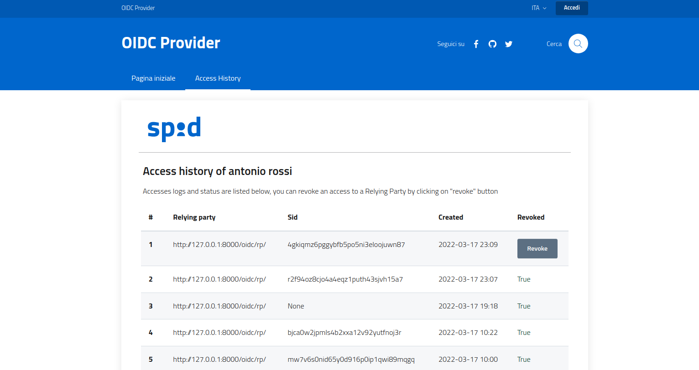

# __Openid Connect Provider__ Identity Provider.

A SPID/CIE implementation of a OpenID Connect Provider fully compliant to
AgID SPID guidelines and CIE id guidelines.

## General settings

All the Provider settings paramenter are available at
[spid_cie_oidc.provider.settings](spie_cie_oidc/provider/settings.py) and
can be inherited in the general settings file of your project.

These are the following:


- `OIDCFED_DEFAULT_PROVIDER_PROFILE`, default profile of the service, if the OP is Spid or CIE.

Example
````
OIDCFED_DEFAULT_PROVIDER_PROFILE = getattr(
    settings,
    "OIDCFED_PROVIDER_PROFILE",
    "Spid"
)
````

- `OIDCFED_PROVIDER_PROFILES_MEDIA`, Logo of the service, for each profile.

Example
````
OIDCFED_PROVIDER_PROFILES_MEDIA = getattr(
    settings,
    "OIDCFED_PROVIDER_PROFILES_MEDIA",
    {
        "spid": {
            "logo": "svg/spid-logo-c-lb.svg"
        },
        "cie": {
            "logo": "images/logo-cie.png"
        },
    },
)
````

- `OIDCFED_PROVIDER_PROFILES`, json validation schemas for each profile.

Example
````
OIDCFED_PROVIDER_PROFILES = getattr(
    settings,
    "OIDCFED_PROVIDER_PROFILES",
    {
        "spid": {
            "authorization_request": AuthenticationRequestSpid,
            "op_metadata": OPMetadataSpid,
            "authorization_code": TokenAuthnCodeRequest,
            "refresh_token": TokenRefreshRequest,
            "revocation_request": RevocationRequest,
            "introspection_request" : IntrospectionRequest,
        },
        "cie": {
            "authorization_request": AuthenticationRequestCie,
            "op_metadata": OPMetadataCie,
            "authorization_code": TokenAuthnCodeRequest,
            "refresh_token": TokenRefreshRequest,
            "revocation_request": RevocationRequest,
            "introspection_request" : IntrospectionRequest,
        },
    },
)
````

- `OIDCFED_PROVIDER_MAX_REFRESH` How many times a token can be refreshed.

Example
````
OIDCFED_PROVIDER_MAX_REFRESH = 1
````

- `OIDCFED_PROVIDER_ATTRIBUTES_SPID_MAP` map of attributes for a spid provider, an example [here](https://github.com/italia/spid-cie-oidc-django/blob/dev/spid_cie_oidc/provider/settings.py#L31)
- `OIDCFED_PROVIDER_ATTRIBUTES_CIE_MAP` map of attributes for a cie provider, an example [here](https://github.com/italia/spid-cie-oidc-django/blob/dev/spid_cie_oidc/provider/settings.py#L60)
- `OIDCFED_PROVIDER_ATTRIBUTES_MAP` map of all provider attributes, an example [here](https://github.com/italia/spid-cie-oidc-django/blob/dev/spid_cie_oidc/provider/settings.py#L77)

- `OIDCFED_PROVIDER_PROFILES_ID_TOKEN_CLAIMS` claims that can be requested to token endpoint.

Example
````
OIDCFED_PROVIDER_PROFILES_ID_TOKEN_CLAIMS = dict(
    spid = dict(), # means that SPID doesn't support user claims in the id_token
    cie = OIDCFED_PROVIDER_ATTRIBUTES_CIE_MAP
)
````

-`OIDCFED_PROVIDER_SALT`, salt used in the hash function used to create the subject identifier of the resource owner (the user).
 
Example
````
OIDCFED_PROVIDER_SALT = getattr(settings, "OIDCFED_PROVIDER_SALT", "CHANGEME")
````

- `OIDCFED_PROVIDER_HISTORY_PER_PAGE`, max entries per page to show in the page of access history.

Example
````
OIDCFED_PROVIDER_HISTORY_PER_PAGE = getattr(settings, "OIDCFED_PROVIDER_HISTORY_PER_PAGE", 50)
````

- `OIDCFED_PROVIDER_AUTH_CODE_MAX_AGE` lifetime of validity of an auth code.

Example
````
OIDCFED_PROVIDER_AUTH_CODE_MAX_AGE = getattr(
    settings,
    "OIDCFED_PROVIDER_AUTH_CODE_MAX_AGE",
    10
)
````

- `OIDCFED_PROVIDER_PROFILES_DEFAULT_ACR` default acr value in the Authentication Request if not sumbmitted by RP.

Example
````
OIDCFED_PROVIDER_PROFILES_DEFAULT_ACR = dict(
    spid = AcrValues.l2.value,
    cie = AcrValues.l2.value
)
````

- `OIDCFED_ATTRNAME_I18N`, attributes internationalization, an example [here](, an example [here](https://github.com/italia/spid-cie-oidc-django/blob/dev/spid_cie_oidc/provider/settings.py#L125))

## Endpoints

the webpath where the provider serve its features are the followins.

### entity configuration (.well-known/openid-federation)

As inherited from [__spid_cie_oidc.entity__](docs/tecnhical_specifications/ENTITY.md).

### authorization

The webpath is customizable in the `urls.py` file and by default it's
configured [here](https://github.com/italia/spid-cie-oidc-django/blob/dev/spid_cie_oidc/provider/urls.py#L16) 
and correspond to `spid_cie_oidc.provider.views.AuthzRequestView`.

The Authorization Endpoint support the use of the HTTP GET and POST methods.

An exemple of accepted request is [heare](https://github.com/italia/spid-cie-oidc-django/blob/dev/spid_cie_oidc/onboarding/tests/authn_request_settings.py#L30)

In the case of successful user authentication, the response contains the following parameters:

- __code__, REQUIRED. Authorization code.
- __state__, REQUIRED. State value enclosed in the authentication requests.
- __iss__, REQUIRED for CIE, OPTIONAL for Spid. Issuer identifier of the OP.
- __scope__, REQUIRED if the scopes are different from those required by RP.

### token

The webpath is customizable in the `urls.py` file and by default it's
configured [here](https://github.com/italia/spid-cie-oidc-django/blob/dev/spid_cie_oidc/provider/urls.py#L27) 
and correspond to `spid_cie_oidc.provider.views.TokenEndpoint`.

Token endpoint support the use only of the HTTP POST method and accepts as grant_type both 'authorization_code' and 'refresh_token'.

### token introspection

The webpath is customizable in the `urls.py` file and by default it's
configured [here](https://github.com/italia/spid-cie-oidc-django/blob/dev/spid_cie_oidc/provider/urls.py#L42) 
and correspond to `spid_cie_oidc.provider.views.IntrospectionEndpoint`.

Introspection endpoint support the use only of the HTTP POST method, an example of acceptet request is [here](https://github.com/italia/spid-cie-oidc-django/blob/dev/spid_cie_oidc/onboarding/tests/introspection_request_settings.py#L3)

In the response the only REQUIRED attribute is __active__, boolean indicator of whether the presented token is currently active.

### token revocation

The webpath is customizable in the `urls.py` file and by default it's
configured [here](https://github.com/italia/spid-cie-oidc-django/blob/dev/spid_cie_oidc/provider/urls.py#L37) 
and correspond to `spid_cie_oidc.provider.views.RevocationEndpoint`.

Revocation endpoint support the use only of the HTTP POST method.

In case of successful token invalidation, responds with an HTTP 200 code.

### userinfo

The webpath is customizable in the `urls.py` file and by default it's
configured [here](https://github.com/italia/spid-cie-oidc-django/blob/dev/spid_cie_oidc/provider/urls.py#L32) 
and correspond to `spid_cie_oidc.provider.views.UserInfoEndpoint`.

The UserInfo Endpoint returns an encrypthed jwt of the user claims.

### Login history page


_The user can consult the history of his accesses and also can revoke the access tokens for selected RPs._

## SPID/CIE QAD and compliances tests

WiP
