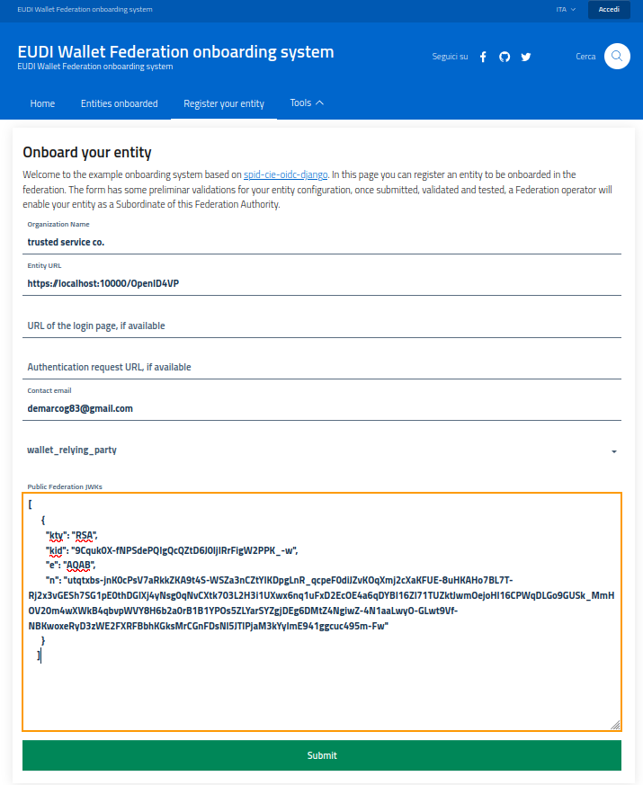
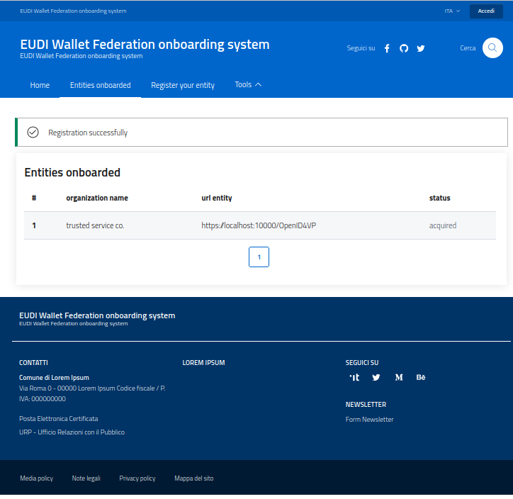
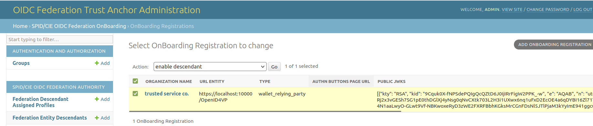
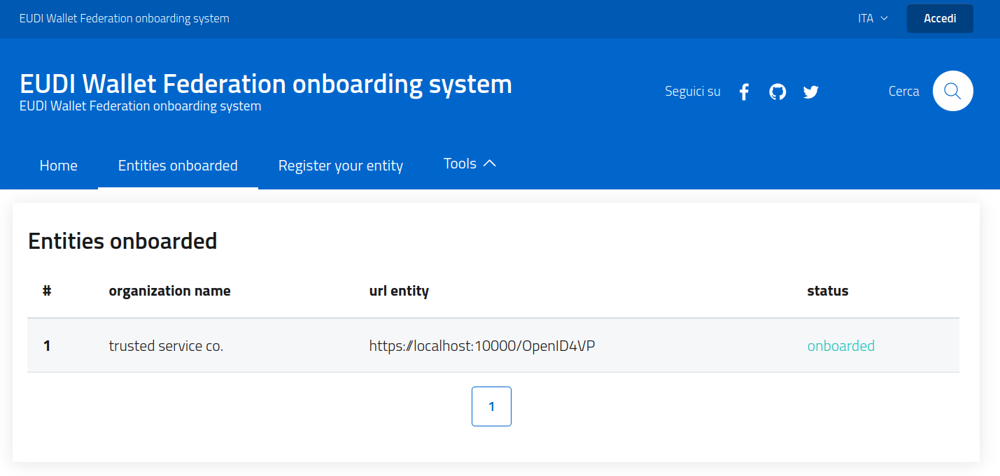

# EUDI Wallet Federation onboarding tutorial


In this document are illustrated the steps to get a fully working onboarding and trust anchor demo.
The sections identified with the prefix **[FedOp]** are related to the Federation operators that 
accreditate the subordinates. The sections identified with the prefix **[User]** are 
related to the User that asks to get a specific Entity onboarded within the onboarding service.

## [FedOp] Configure the Trust Anchor

For demo purpose you can even import the backup files located in the [dumps](dumps) 
folder, containing a demo Trust Anchor setup.

Generally, an admin that configures this project creates the schemas, creates a superuser to access to the admin backend and then imports the backup of the demo configuration.
````
./manage.py migrate
./manage.py createsuperuser
./manage.py loaddata dumps/$dumpfile.json
````

## [User] Onboard an entity

Go to [the onboarding demo service](127.0.0.1:8000/onboarding/landing) and click
on the button `Register your entity`.

### [User] Fill the form

Fill the form field as show in the picture below.



Then click on the button `Submit`. If the validation of the Entity's configuration passes,
the User will be redirected to the onboarding status page, as shown below:


 
Now the onboarding request is verified and accepted, then it requires an 
administrative validation from the Federation operators.

### [FedOp] enable the descendant

The admins of the platform checks the pending onboarding requests and then
selects the ones that are eligible to be subordinates of the Trust Anchor.



### [User] obtain the Entity Statement

The onboarding request appears as completed with success.



Then the User connects to 
[the fetch endpoint](http://127.0.0.1:8000/fetch?sub=https://localhost:10000/OpenID4VP&anchor=http://127.0.0.1:8000)
and obtains the entity statement related to the onboarded Entity as a proof of the fully operational setup.

Below an example of the payload contained within an Entity Statement, with the minimum set of attributes made available, according to OIDC Federation 1.0 and this demo.

````
{
  "exp": 1690907465,
  "iat": 1690734665,
  "iss": "http://127.0.0.1:8000",
  "sub": "https://localhost:10000/OpenID4VP",
  "jwks": {
    "keys": [
      {
        "kty": "RSA",
        "kid": "9Cquk0X-fNPSdePQIgQcQZtD6J0IjIRrFigW2PPK_-w",
        "e": "AQAB",
        "n": "utqtxbs-jnK0cPsV7aRkkZKA9t4S-WSZa3nCZtYIKDpgLnR_qcpeF0diJZvKOqXmj2cXaKFUE-8uHKAHo7BL7T-Rj2x3vGESh7SG1pE0thDGlXj4yNsg0qNvCXtk703L2H3i1UXwx6nq1uFxD2EcOE4a6qDYBI16Zl71TUZktJwmOejoHl16CPWqDLGo9GUSk_MmHOV20m4wXWkB4qbvpWVY8H6b2a0rB1B1YPOs5ZLYarSYZgjDEg6DMtZ4NgiwZ-4N1aaLwyO-GLwt9Vf-NBKwoxeRyD3zWE2FXRFBbhKGksMrCGnFDsNl5JTlPjaM3kYyImE941ggcuc495m-Fw"
      }
    ]
  },
  "source_endpoint": "http://127.0.0.1:8000/fetch"
}
````

